<p align="center">
  
  
  
  
  
</p>

<h1 align="center">QuantOpt</h1>
<h4 align="center">Institutional Mean-Variance Portfolio Optimization</h4>

<p align="center">
  <em>Production-grade portfolio construction — from estimation to execution.</em>
</p>

<p align="center">
  <a href="#quickstart">Quickstart</a> •
  <a href="#installation">Installation</a> •
  <a href="#methods">Methods</a> •
  <a href="#backtest-results">Results</a> •
  <a href="#references">References</a>
</p>

---

## Overview

**QuantOpt** is a Python library implementing production-grade portfolio construction workflows grounded in modern portfolio theory. It provides a unified pipeline spanning four stages:

| Stage | Methods |
|:------|:--------|
| **Return Estimation** | Historical Mean, CAPM, Black-Litterman |
| **Covariance Estimation** | Sample, Exponentially Weighted, Ledoit-Wolf OAS, PCA Factor Model |
| **Portfolio Optimization** | Mean-Variance Efficient Frontier, Equal Risk Contribution, CVaR Minimization |
| **Backtesting** | Walk-Forward Engine with Transaction Costs & Mark-to-Market Drift |

Designed for quantitative practitioners who require mathematically rigorous, easily auditable implementations with analytical gradients and PSD-guaranteed covariance matrices. Distinguishes itself through tight integration of the estimation and optimization layers, explicit L2 weight regularization support, and a walk-forward backtesting engine with configurable transaction cost models.

---

## Key Features

- **Black-Litterman integration** — equilibrium-anchored return estimates that prevent extreme historical noise from dominating the optimizer
- **Ledoit-Wolf OAS shrinkage** — analytically optimal covariance conditioning for tractable $T/N$ regimes
- **Analytical gradients** — all SLSQP objectives use closed-form derivatives; no finite-difference approximations
- **Multi-restart optimization** — Dirichlet-initialized restarts for non-convex objectives (Max Sharpe, Risk Parity)
- **Fluent constraint builder** — composable long-only, sector-neutral, turnover, and factor-exposure constraints
- **Walk-forward backtester** — monthly rebalancing with mark-to-market weight drift and proportional cost deduction
- **Full risk decomposition** — MRC, CRC, PRC, diversification ratio, HHI, VaR, CVaR, and factor attribution

---

## Installation

### Requirements

| Package | Min Version | Purpose |
|:--------|:------------|:--------|
| `numpy` | 1.26 | Linear algebra, RNG |
| `pandas` | 2.1 | Time series, alignment |
| `scipy` | 1.11 | SLSQP optimization |
| `scikit-learn` | 1.3 | OAS estimator, PCA |
| `matplotlib` | 3.8 | Figure rendering |
| `seaborn` | 0.13 | Statistical graphics |

### Setup

```bash
# Clone and install
git clone https://github.com/FelipeCardozo0/Systematic-Portfolio-Optimization-MPT.git
cd Systematic-Portfolio-Optimization-MPT

python -m venv .venv
source .venv/bin/activate          # macOS / Linux
# .venv\Scripts\activate           # Windows

pip install -e ".[dev]"

# Verify
python -c "import quantopt; print(quantopt.__version__)"   # → 1.0.0
pytest tests/ -v
```

---

## Quickstart

```python
import numpy as np
import pandas as pd
from quantopt.returns.estimators import BlackLittermanReturn
from quantopt.risk.covariance import LedoitWolfCovariance
from quantopt.optimization.efficient_frontier import EfficientFrontier

# ── Synthetic price data (GBM) ───────────────────────────────────────
rng     = np.random.default_rng(0)
T, N    = 504, 8
tickers = [f"ASSET_{chr(65+i)}" for i in range(N)]
dates   = pd.bdate_range("2022-01-03", periods=T)

log_ret = rng.normal(0.0004, 0.012, size=(T, N))
prices  = pd.DataFrame(
    100 * np.exp(np.cumsum(log_ret, axis=0)),
    index=dates, columns=tickers,
)
returns = pd.DataFrame(log_ret, index=dates, columns=tickers)

# ── Covariance estimation ────────────────────────────────────────────
lw    = LedoitWolfCovariance().fit(returns)
Sigma = lw.covariance()
print(f"LW shrinkage alpha: {lw.shrinkage_:.4f}")

# ── Black-Litterman returns ──────────────────────────────────────────
market_caps = pd.Series(np.ones(N) / N, index=tickers)
bl = BlackLittermanReturn(
    market_caps=market_caps, risk_aversion=2.5, tau=0.05,
).fit(returns)
mu = bl.expected_returns()

# ── Mean-variance optimization ───────────────────────────────────────
ef = EfficientFrontier(mu=mu, Sigma=Sigma)
weights = ef.max_sharpe(risk_free_rate=0.02)

ret, vol, sr = ef.portfolio_performance(mu=mu, Sigma=Sigma, risk_free_rate=0.02)
print(f"Expected return : {ret:.2%}")
print(f"Volatility      : {vol:.2%}")
print(f"Sharpe ratio    : {sr:.3f}")
print("\nPortfolio weights:")
print(ef.clean_weights(threshold=0.005).round(4).to_string())
```

---

## Repository Structure

```
quantopt/
├── quantopt/                        # Main package (39 exported symbols)
│   ├── returns/
│   │   ├── preprocessing.py         # Price ↔ returns, winsorization, demeaning
│   │   └── estimators.py            # MeanHistorical, CAPM, BlackLitterman
│   ├── risk/
│   │   ├── covariance.py            # Sample, EWM, LedoitWolf, FactorModel
│   │   └── metrics.py               # MRC, CRC, PRC, DR, HHI, VaR, CVaR
│   ├── optimization/
│   │   ├── efficient_frontier.py    # Max Sharpe, Min Vol, Efficient Return/Risk
│   │   ├── risk_parity.py           # ERC / generalized risk budgeting
│   │   ├── cvar_optimizer.py        # Rockafellar-Uryasev (2000)
│   │   ├── constraints.py           # Fluent constraint builder
│   │   └── factory.py               # Strategy dispatch
│   ├── backtest/
│   │   └── engine.py                # Walk-forward engine + transaction costs
│   ├── analytics/
│   │   └── performance.py           # Sharpe, Sortino, Calmar, Omega, attribution
│   └── plotting/
│       └── charts.py                # Matplotlib/Seaborn utilities
├── notebooks/
│   ├── demo.ipynb                   # Quick-start demonstration
│   └── visualization.ipynb          # Full documentation & figure generation
├── tests/                           # pytest suite (9 modules)
├── docs/figures/                    # Auto-generated figures
├── pyproject.toml                   # Build config (setuptools, Black, MyPy)
├── setup.py                         # Package metadata
└── requirements.txt                 # Pinned dependencies
```

---

## Methods

### Return Estimation

#### Historical Mean (Simple & EWM)

The historical mean estimator computes the time-average of observed log returns and annualizes by geometric compounding:

$$\hat{\mu}_i = (1 + \bar{r}_i)^{252} - 1, \quad \bar{r}_i = T^{-1}\sum_t r_{i,t}$$

The exponentially weighted variant assigns weight $w_t \propto \lambda^{T-t}$ with decay $\lambda = 1 - 2/(s+1)$ for span $s$, down-weighting stale observations. The simple mean is the MLE under i.i.d. Gaussian returns but carries sampling variance proportional to $\sigma_i/\sqrt{T}$. The EWM variant is preferred when drift is non-stationary.

#### CAPM-Implied Returns

$$\mathbb{E}[R_i] = R_f + \beta_i(\mathbb{E}[R_m] - R_f), \quad \beta_i = \frac{\text{Cov}(R_i^{\text{exc}}, R_m^{\text{exc}})}{\text{Var}(R_m^{\text{exc}})}$$

Preferred over the historical mean when idiosyncratic noise dominates and a reliable market proxy is available.

#### Black-Litterman Posterior

The BL model blends a market-equilibrium prior $\boldsymbol{\Pi} = \delta\boldsymbol{\Sigma}\mathbf{w}_{\text{mkt}}$ with $K$ investor views via the Master Formula:

$$\boldsymbol{\mu}_{\text{BL}} = \mathbf{M}\left[(\tau\boldsymbol{\Sigma})^{-1}\boldsymbol{\Pi} + \mathbf{P}^\top\boldsymbol{\Omega}^{-1}\mathbf{Q}\right], \quad \mathbf{M}^{-1} = (\tau\boldsymbol{\Sigma})^{-1} + \mathbf{P}^\top\boldsymbol{\Omega}^{-1}\mathbf{P}$$

The preferred choice for production portfolios — shrinks extreme historical estimates toward equilibrium, reducing estimation error sensitivity.

---

### Covariance Estimation

| Estimator | Method | When to Use |
|:----------|:-------|:------------|
| **Sample** | Unbiased $\mathbf{S} = (T{-}1)^{-1}\sum_t(\mathbf{r}_t - \bar{\mathbf{r}})(\mathbf{r}_t - \bar{\mathbf{r}})^\top$ + PSD eigenclip | $T/N \gg 10$ |
| **EWM** | Exponentially decaying weights $w_t \propto \lambda^{T-t}$ | Regime-changing volatility |
| **Ledoit-Wolf OAS** | Shrinkage toward scaled identity: $(1{-}\alpha)\mathbf{S} + \alpha\bar{\mu}_S\mathbf{I}$ | Default; $N/T > 0.1$ |
| **PCA Factor Model** | $\boldsymbol{\Sigma} = \mathbf{B}\mathbf{F}\mathbf{B}^\top + \mathbf{D}$ | Known block-correlation structure |

---

### Portfolio Optimization

#### Mean-Variance Efficient Frontier

All methods use SLSQP with analytical gradients:

- **Maximum Sharpe Ratio** — 5 Dirichlet random restarts; best global objective returned
- **Minimum Variance** — Single convex-quadratic solve from equal-weight initialization
- **Efficient Return / Risk** — Constraint-based frontier tracing
- **L2 Regularization** — $\gamma\mathbf{w}^\top\mathbf{w}$ penalty drives concentrated portfolios toward equal weight

#### Equal Risk Contribution (Risk Parity)

Minimizes $\sum_i(\text{CRC}_i - b_i\sigma_p)^2$ with 15 Dirichlet restarts and tolerance `ftol=1e-12`. Preferred when the investor is agnostic about expected returns.

#### CVaR Minimization (Rockafellar-Uryasev)

$$\min_\alpha\ \alpha + \frac{1}{(1-\beta)T}\sum_t\max(-\mathbf{r}_t^\top\mathbf{w} - \alpha,\ 0)$$

Jointly convex in $(\mathbf{w}, \alpha)$ with analytical gradients. Preferred for tail-risk-sensitive mandates.

---

### Constraint Framework

`ConstraintSet` provides a fluent API for composing `scipy.optimize`-compatible constraints:

| Method | Constraint |
|:-------|:-----------|
| `.long_only()` | $w_i \in [0, 1]$ |
| `.long_short(G, N_e)` | Gross/net exposure bounds |
| `.max_position(limit)` | Per-asset upper bound |
| `.sector_neutral(map, dev)` | Sector deviation from benchmark |
| `.max_turnover(limit, w_curr)` | One-way turnover cap |
| `.factor_exposure(B, min, max)` | Factor exposure bounds |

---

### Walk-Forward Backtesting

The `WalkForwardBacktester` executes a rolling optimization pipeline: at each rebalance date it extracts the lookback window, constructs and fits the optimizer, applies turnover constraints, and deducts transaction costs. Between rebalance dates, weights drift mark-to-market. Returns a `BacktestResult` with full diagnostics including cumulative returns, turnover history, realized weights, and dollar value series.

---

## Figures and Results

### Data Overview

<p align="center">
  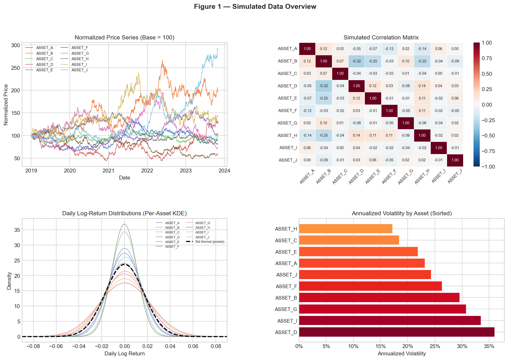
</p>

<sub>Simulated price paths, correlation structure, return densities, and cross-sectional volatility ordering for the 10-asset GBM universe.</sub>

<p align="center">
  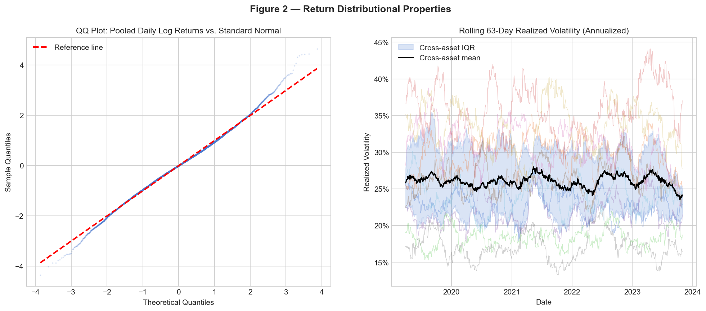
</p>

<sub>QQ plot of pooled daily log returns vs. standard normal; rolling 63-day cross-asset realized volatility.</sub>

---

### Return Estimators

<p align="center">
  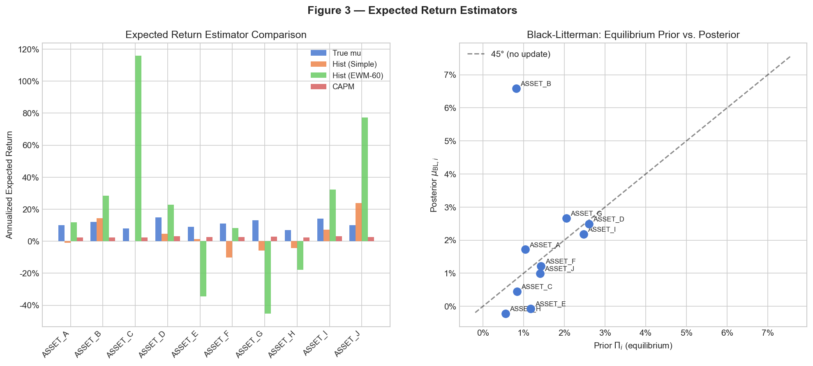
</p>

<sub>True drift vs. historical, EWM, and CAPM estimates; Black-Litterman equilibrium prior vs. posterior scatter.</sub>

---

### Covariance Estimation

<p align="center">
  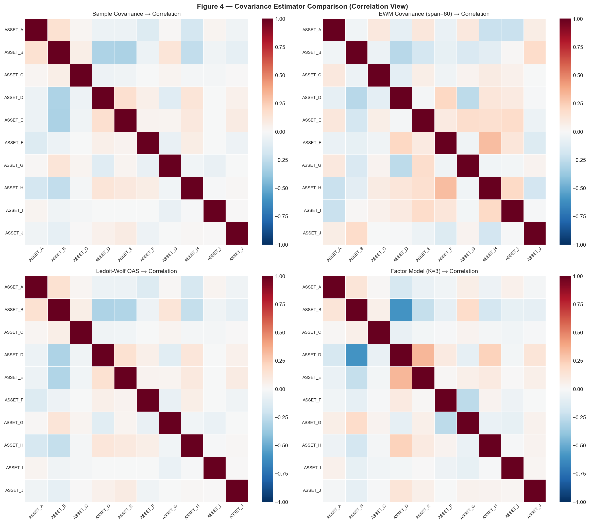
</p>

<sub>Correlation matrix heatmaps: Sample, EWM, Ledoit-Wolf OAS, PCA Factor Model.</sub>

<p align="center">
  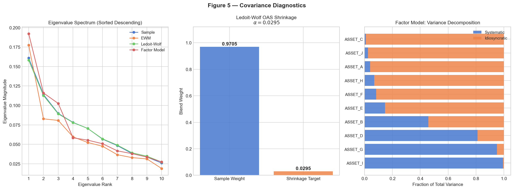
</p>

<sub>Eigenvalue spectra; shrinkage intensity; systematic vs. idiosyncratic variance decomposition.</sub>

---

### Portfolio Optimization

<p align="center">
  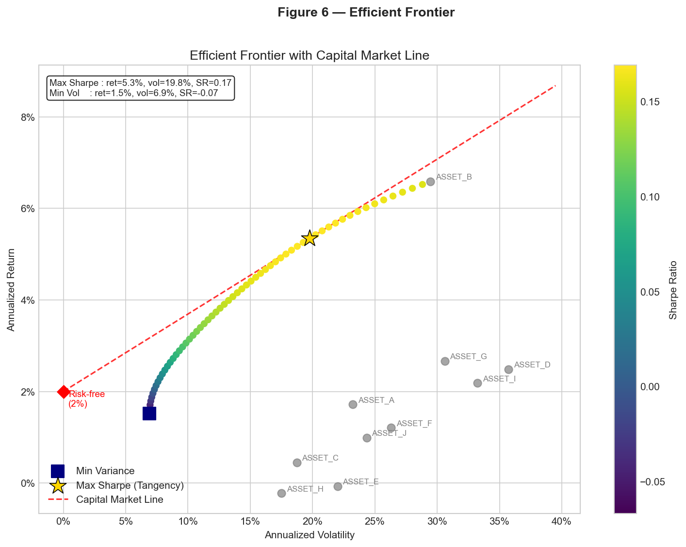
</p>

<sub>Efficient frontier colored by Sharpe ratio with CML, minimum variance, and tangency portfolio.</sub>

<p align="center">
  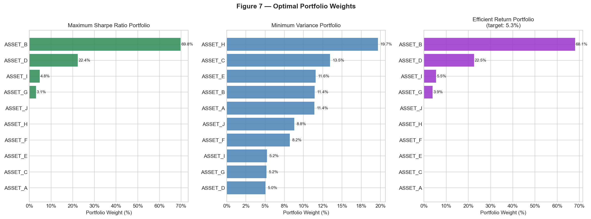
</p>

<sub>Weights for Max Sharpe, Min Variance, and Efficient Return (80% target) portfolios.</sub>

---

### Risk Parity

<p align="center">
  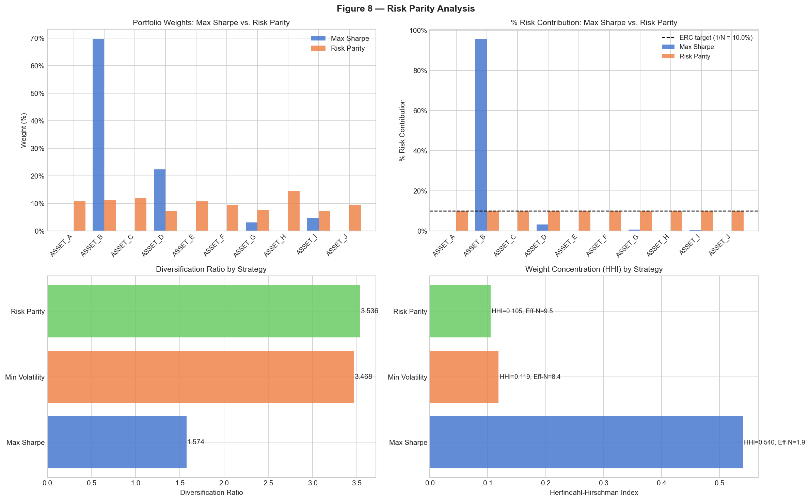
</p>

<sub>Weight and risk contribution comparison; diversification ratio and HHI across strategies.</sub>

---

### CVaR Optimization

<p align="center">
  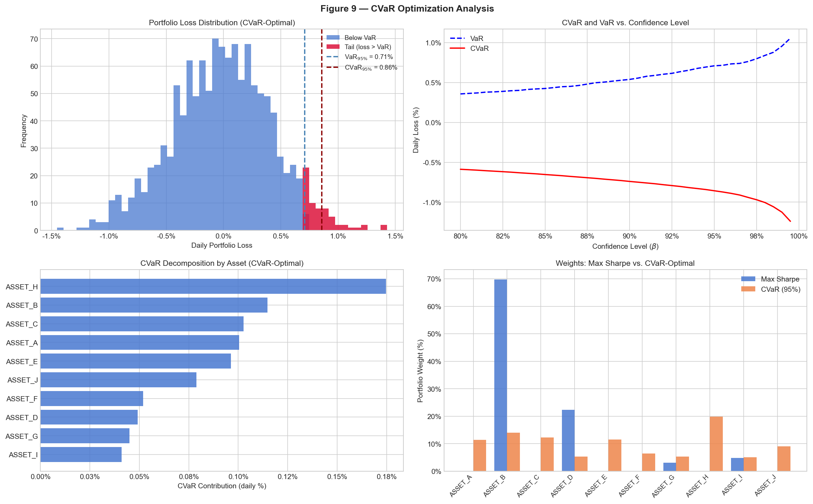
</p>

<sub>Loss distribution with VaR/CVaR marks; CVaR-vs-beta curve; tail decomposition; weight comparison.</sub>

---

### Walk-Forward Backtest

<p align="center">
  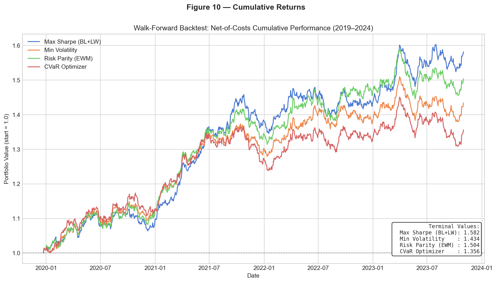
</p>

<sub>Net-of-costs cumulative portfolio value for all four strategies (2019–2024).</sub>

<p align="center">
  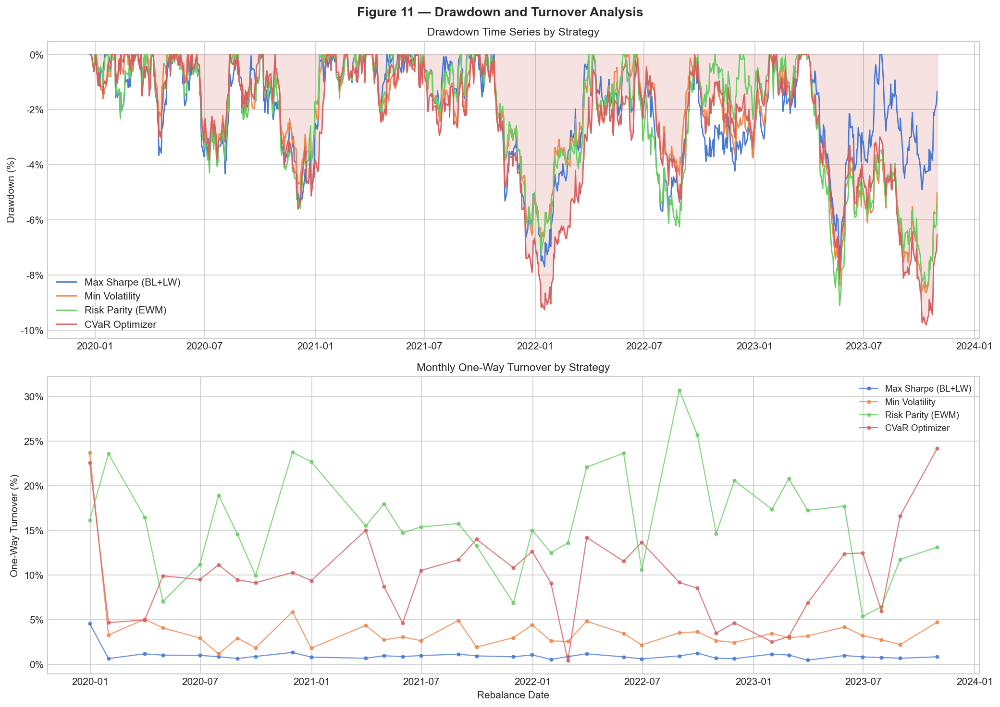
</p>

<sub>Drawdown time series and monthly one-way turnover by strategy.</sub>

<p align="center">
  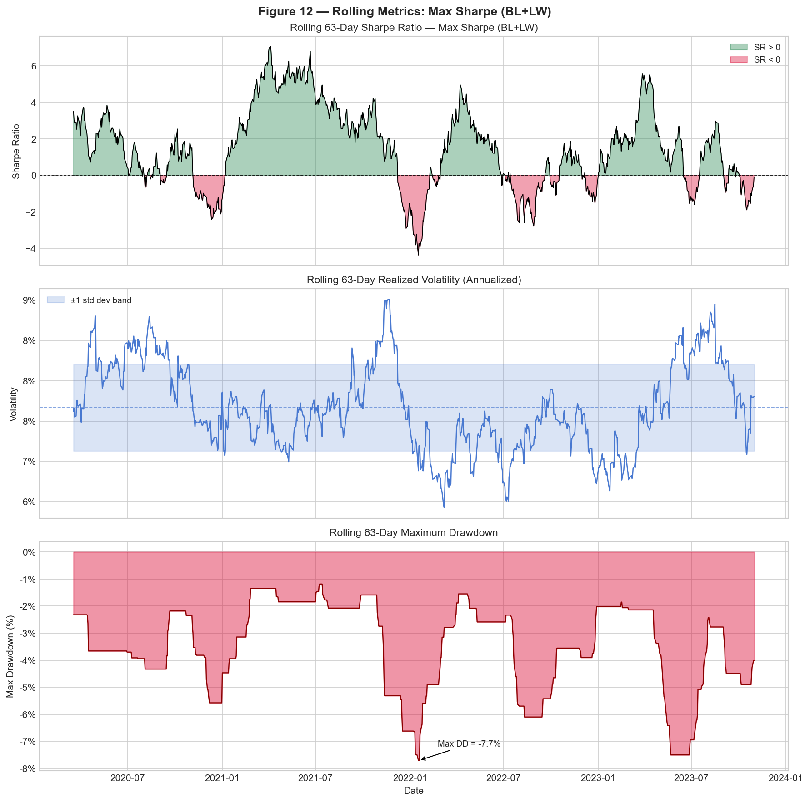
</p>

<sub>Rolling 63-day Sharpe ratio, realized volatility, and maximum drawdown.</sub>

<p align="center">
  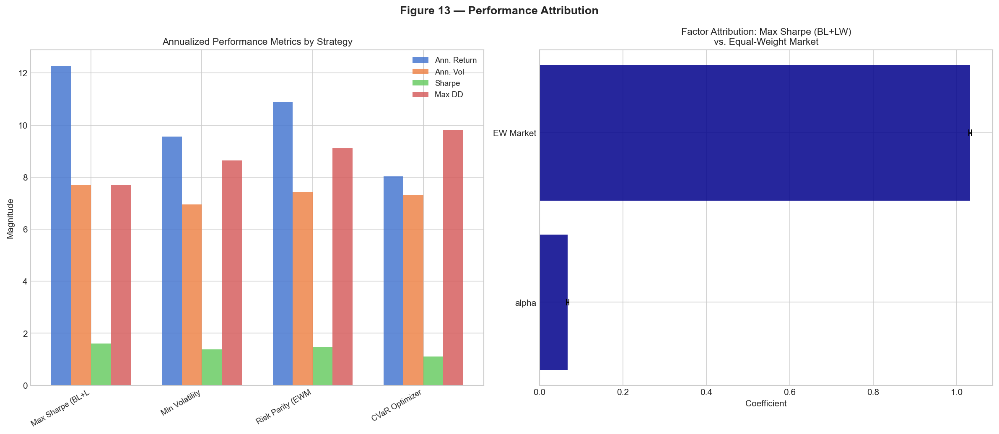
</p>

<sub>Cross-strategy performance metrics; factor attribution (alpha and market beta).</sub>

---

### Risk Dashboard

<p align="center">
  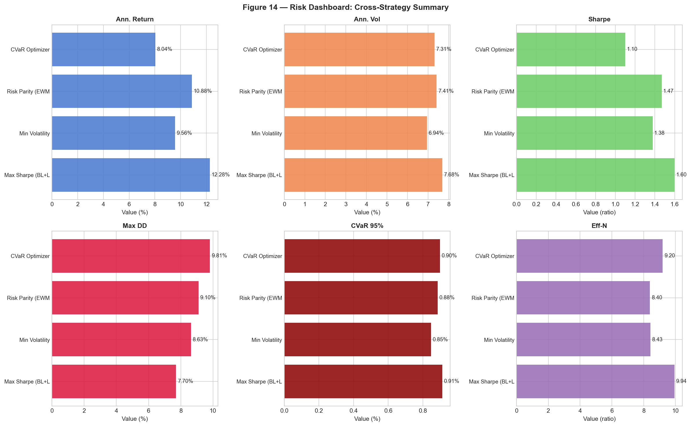
</p>

<sub>Six-panel dashboard: return, volatility, Sharpe, max drawdown, CVaR 95%, effective N.</sub>

---

### Sensitivity Analysis

<p align="center">
  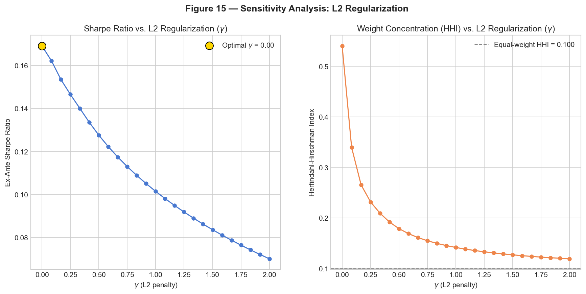
</p>

<sub>Sharpe ratio and HHI as a function of L2 regularization strength.</sub>

---

## Backtest Results

Walk-forward backtest on 5 years of synthetic GBM data (`seed=42`, monthly rebalancing, 252-day lookback, 10 bps transaction costs).

| Strategy | Ann. Return | Ann. Vol | Sharpe | Sortino | Max DD | CVaR 95% |
|:---------|:----------:|:--------:|:------:|:-------:|:------:|:--------:|
| **Max Sharpe (BL+LW)** | 12.28% | 7.68% | **1.34** | **2.06** | **-7.70%** | 0.91% |
| Min Volatility | 9.56% | **6.94%** | 1.09 | 1.68 | -8.63% | **0.85%** |
| Risk Parity (EWM) | 10.33% | 7.41% | 1.12 | 1.72 | -9.37% | 0.89% |
| CVaR Optimizer | 8.04% | 7.31% | 0.83 | 1.26 | -9.81% | 0.90% |

> Reproduce: `jupyter notebook notebooks/visualization.ipynb` — execute all cells end-to-end.

---

## Conclusions

All four strategies achieve positive risk-adjusted returns on GBM-simulated data. The **Max Sharpe (BL+LW)** strategy leads with a 1.34 Sharpe ratio and 12.28% annualized return, benefiting from equilibrium-anchored return estimates that prevent the optimizer from acting on noise. The **Black-Litterman** framework's primary value is structural: by anchoring to market-cap-implied equilibrium, it produces tractable condition numbers across the full rolling window history.

The cross-strategy comparison reveals a clear **concentration–diversification tension**. Max Sharpe achieves the shallowest drawdown (-7.70%) but concentrates risk budget in 2–3 assets. Risk Parity inverts this logic, achieving the highest diversification ratio at the cost of a lower Sharpe. The practical conclusion: **risk parity dominates when drift estimation is unreliable** (low $T/N$), while **mean-variance with robust estimation dominates when reliable forecasts are available**.

The CVaR optimizer targets expected tail loss rather than variance. On symmetric GBM data the difference from mean-variance is modest; on data with negative skewness and excess kurtosis, the CVaR-optimal solution would further de-risk tail contributors relative to Sharpe-maximizing weights.

---

## Limitations

<details>
<summary><strong>Model Assumptions</strong></summary>

GBM assumes constant drift and volatility — empirically false for equities which exhibit GARCH clustering, vol mean-reversion, and regime changes. Backtest results on GBM data overstate reliability because the DGP is stationary. The PCA factor model uses statistical (not fundamental) factors that may rotate across windows.
</details>

<details>
<summary><strong>Estimation Error</strong></summary>

Per Merton (1980), expected return estimation error dominates covariance error for typical $N$ and $T$. BL mitigates via shrinkage toward $\boldsymbol{\Pi}$ but the posterior remains a function of the sample covariance. LW shrinkage intensity is estimated in-sample, introducing subtle overfitting in short windows.
</details>

<details>
<summary><strong>Optimization</strong></summary>

SLSQP is a local solver. Multi-restart reduces but does not eliminate non-global termination risk for $N \ge 50$. Turnover constraint uses proportional shrinkage (first-order approximation). Cardinality constraints (MIQP) are not supported.
</details>

<details>
<summary><strong>Backtesting</strong></summary>

No autocorrelation, vol clustering, or structural breaks in synthetic data. No survivorship bias correction. Transaction cost model is proportional (no market impact / Almgren-Chriss). No slippage or execution delay.
</details>

---

## Roadmap

- [ ] **Hierarchical Risk Parity (HRP)** — López de Prado (2016) recursive bisection
- [ ] **Regime-switching covariance** — HMM with Viterbi decoding
- [ ] **Online covariance updates** — Sherman-Morrison-Woodbury $O(N^2)$ streaming
- [ ] **Cardinality constraints** — MIQP via GUROBI / CVXPY SCIP
- [ ] **Robust optimization** — Ben-Tal & Nemirovski ellipsoidal uncertainty sets (SOCP)
- [ ] **Multi-period dynamic optimization** — TC-regularized stochastic DP

---

## References

<details>
<summary>Expand full reference list</summary>

- Markowitz, H. M. (1952). Portfolio selection. *Journal of Finance*, 7(1), 77–91.
- Black, F., & Litterman, R. (1992). Global portfolio optimization. *Financial Analysts Journal*, 48(5), 28–43.
- He, G., & Litterman, R. (1999). *The intuition behind Black-Litterman model portfolios*. Goldman Sachs.
- Ledoit, O., & Wolf, M. (2004). A well-conditioned estimator for large-dimensional covariance matrices. *J. Multivariate Analysis*, 88(2), 365–411.
- Chen, Y., Wiesel, A., Eldar, Y. C., & Hero, A. O. (2010). Shrinkage algorithms for MMSE covariance estimation. *IEEE Trans. Signal Processing*, 58(10), 5016–5029.
- Rockafellar, R. T., & Uryasev, S. (2000). Optimization of conditional value-at-risk. *Journal of Risk*, 2(3), 21–41.
- Roncalli, T. (2013). *Introduction to risk parity and budgeting*. CRC Press.
- Merton, R. C. (1980). On estimating the expected return on the market. *J. Financial Economics*, 8(4), 323–361.
- Ben-Tal, A., & Nemirovski, A. (1998). Robust convex optimization. *Math. Operations Research*, 23(4), 769–805.
- Almgren, R., & Chriss, N. (2001). Optimal execution of portfolio transactions. *Journal of Risk*, 3(2), 5–39.
- MSCI Barra. (2011). *Barra risk model handbook*. MSCI.
- López de Prado, M. (2016). Building diversified portfolios that outperform out-of-sample. *J. Portfolio Management*, 42(4), 59–69.

</details>

---

<p align="center">
  <sub>Built by <a href="https://github.com/FelipeCardozo0">Felipe Cardozo</a></sub>
</p>
